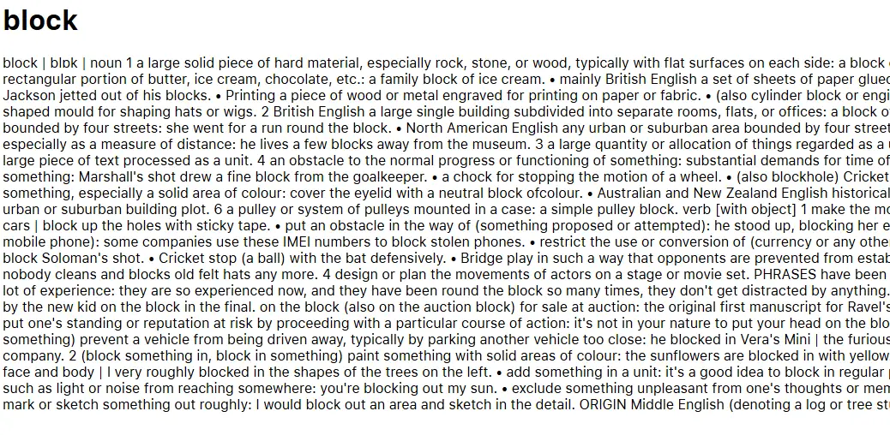
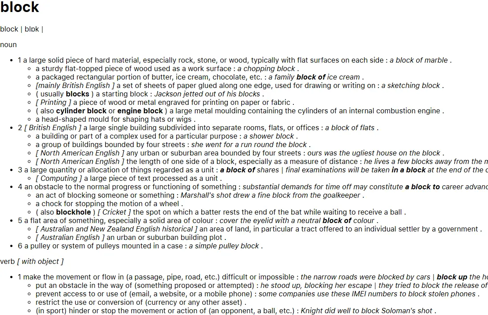

# appledict2semantic

appledict2semantic is a Python tool to convert Apple Dictionary HTML files into clean, semantic HTML. It removes the dependency on the custom CSS by mapping span class names to appropriate semantic HTML tags and structural markup, making the output more readable and portable.

## Screenshots

Before conversion:



After conversion:



## Features

- Span-to-semantic conversion: Converts Apple Dictionary’s `<span class="...">` elements into semantic HTML tags like `<strong>`, `<em>`, `<u>`, and more.
- Structural transformation: Transforms sense and subsense blocks into nested lists `<ul>`, `<li>` for better readability.
- Block conversion: Converts etymology, derivatives, and usage note blocks into more meaningful HTML structures. This paves way for further processing, e.g. to convert to Markdown.
- Cleanup: Removes unnecessary or empty tags, and replaces bullet spans with proper list items.
- Batch processing: Supports processing single files or entire folders, with optional in-place replacement.

## Installation

Make sure that you have Python 3.10 or higher installed.

Then install the package from PyPI:

```bash
pip install appledict2semantic
```

## Obtain and extract Apple Dictionary HTML files

### How to obtain

To obtain the Apple Dictionary, first you need to have a macOS.

Then, open the Dictionary app, select Dictionary > Settings. Choose the sources you want to download.

The dictionary files are stored in `/System/Library/AssetsV2/com_apple_MobileAsset_DictionaryServices_dictionaryOSX`.

### How to extract

Install `pyglossary`:

```bash
pip install pyglossary
```

Then use `pyglossary` to point to the `Body.data` file, and convert to AppleDict Source. This will produces a XML file.

From there, use [this script](https://gist.github.com/yell0wsuit/c25632f7c863d194edb2ded6d22a3cc3) to extract the XML file to HTML files.

## Usage

- Converts a single Apple Dictionary HTML file to semantic HTML:

  ```bash
  appledict2semantic --single input.html output.html
  ```

- Processes all .html files in `input_folder`, saving results to `output_folder`:

  ```bash
  appledict2semantic --multiple input_folder output_folder
  ```

- Processes all .html files in `input_folder`, replacing the original files:

  ```bash
  appledict2semantic --multiple input_folder --replace
  ```

  You will need to confirm the action.

## License

This project is licensed under the MIT License. See the [LICENSE](LICENSE) file for details.
